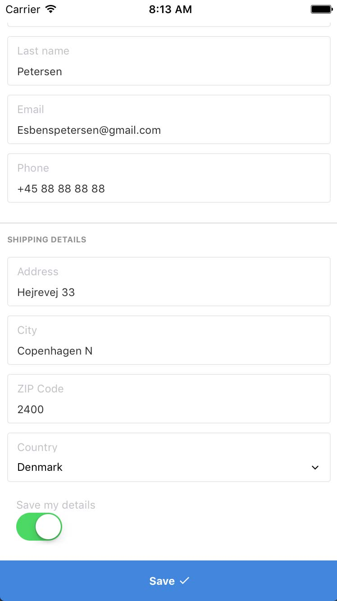
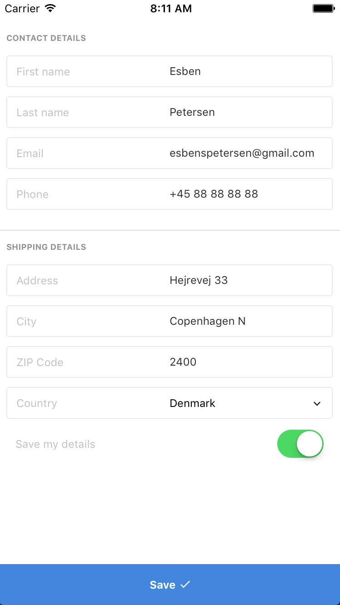
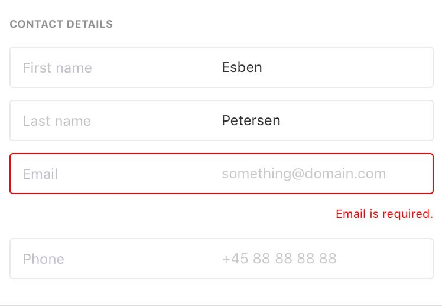
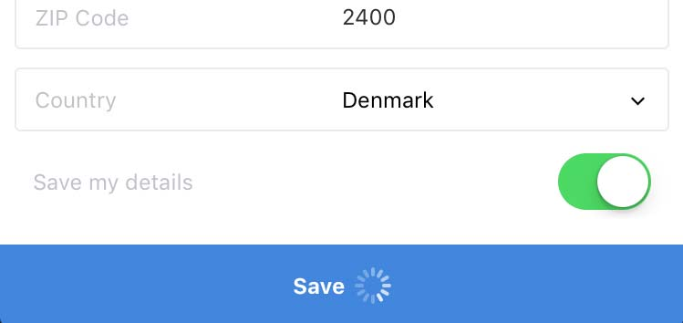

# react-native-clean-form

Easy react-native forms using bootstrap-like syntax with redux-form+immutablejs integration. Styled using styled-components

## Big kudos to Artyom Khamitov

**The look of the form was [inspired by this shot by Artyom Khamitov](https://dribbble.com/shots/3151351-Checkout-form).
[Check out his profile on Dribbble](https://dribbble.com/gmax).**

---




* Form elements with syntax inspired by Bootstrap
* Styled using [styled-components](https://github.com/styled-components/styled-components). Easily extendible.
* Integrated with [redux-form](https://github.com/erikras/redux-form)
* Supports [immutable.js](https://github.com/facebook/immutable-js) state

<br><br><br><br><br><br><br><br><br><br><br><br><br><br>

---

## Installation

Run `npm install --save react-native-clean-form`

The form uses `react-native-vector-icons` so it is important the fonts are linked by using `react-native link` 
[or one of the other options available](https://github.com/oblador/react-native-vector-icons#ios).

## Example

[I have written an article on my blog about React Native and redux-form](http://esbenp.github.io/2017/01/06/react-native-redux-form-immutable-styled-components/)

**[For a complete example check out the example folder](https://github.com/esbenp/react-native-clean-form/tree/master/example)**

## Usage

```javascript
import {
  ActionsContainer,
  Button,
  FieldsContainer,
  Fieldset,
  Form,
  FormGroup,
  Input,
  Label,
  Switch
} from 'react-native-clean-form'

const FormView = props => (
  <Form>
    <FieldsContainer>
      <Fieldset label="Contact details">
        <FormGroup>
          <Label>First name</Label>
          <Input placeholder="Esben" onChangeText={this.onFirstNameChange} />
        </FormGroup>
        <FormGroup>
          <Label>Email</Label>
          <Input placeholder="esbenspetersen@gmail.com" onChangeText={this.onEmailChange} />
        </FormGroup>
      </Fieldset>
      <Fieldset label="Password" last>
        <FormGroup>
          <Label>Password</Label>
          <Input placeholder="Enter a password" onChangeText={this.onPasswordChange} />
        </FormGroup>
        <FormGroup>
          <Label>Repeat password</Label>
          <Input placeholder="Repeat your password" onChangeText={this.onRepeatPasswordChange} />
        </FormGroup>
        <FormGroup border={false}>
          <Label>Save my password</Label>
          <Switch onValueChange={this.toggleSaveMyPassword} />
        </FormGroup>     
      </Fieldset>
    </FieldsContainer>
    <ActionsContainer>
      <Button icon="md-checkmark" iconPlacement="right" onPress={this.save}>Save</Button>
    </ActionsContainer>
  </Form>
)
```

## Usage with redux-form

```javascript
import React from 'react'
import { reduxForm } from 'redux-form'
import {
  ActionsContainer,
  Button,
  FieldsContainer,
  Fieldset,
  Form,
  FormGroup,
  Label,
} from 'react-native-clean-form'
import {
  Input,
  Switch
} from 'react-native-clean-form/redux-form'
import { View,Text } from 'react-native'

const onSubmit = (values, dispatch) => {
  return new Promise((resolve) => {
    setTimeout(() => {
      console.log(values)
      resolve()
    }, 1500)
  })
}

const FormView = props => {
  const { handleSubmit, submitting } = this.props

  return (
    <Form>
      <FieldsContainer>
        <Fieldset label="Contact details">
          <Input name="first_name" label="First name" placeholder="John" />
          <Input name="email" label="Email" placeholder="something@domain.com" />
        </Fieldset>
        <Fieldset label="Shipping details" last>
          <Input name="password" label="Address" placeholder="Hejrevej 33" />
          <Input name="password_repeat" label="City" placeholder="Copenhagen" />
          <Switch label="Save my details" border={false} name="save_details" />
        </Fieldset>
      </FieldsContainer>
      <ActionsContainer>
        <Button icon="md-checkmark" iconPlacement="right" onPress={handleSubmit(onSubmit)} submitting={submitting}>Save</Button>
      </ActionsContainer>
    </Form>
  )
}

export default reduxForm({
  form: 'Form'
})(FormView)
```

## Usage with redux-form and Immutable.js

To make it work with Immutable.js import `Input`, `Select`, and `Switch` from `react-native-clean-form/redux-form-immutable` 
instead of `react-native-clean-form/redux-form`. 
[Also, check out the included example](https://github.com/esbenp/react-native-clean-form/tree/master/example)

## Validation



If integrating with `redux-form` validation is supported right out of the box. Just add a `validation` key to `reduxForm` 
your normally would.

If not using `redux-form`, there is an `error` prop on `FormGroup` which will display the error if used.

<br><br><br><br>

## Async feedback



The `Button` component has a `submitting` prop. If true, a spinner will be displayed.

<br><br><br><br>

## Run the example

Clone the repo first.

```
git clone https://github.com/esbenp/react-native-clean-form && cd react-native-clean-form
```

Install dependencies.

```
cd example
npm install
```

Run the simulator.

```
react-native run-ios
```
